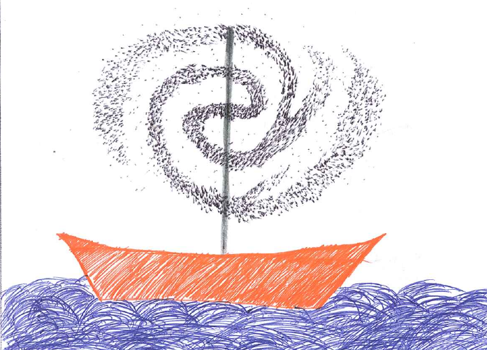

# ABISM: Adaptive Background Interferometric Strehl Meter.

[](https://github.com/tinmarino/abism/actions)
> A [GUI](https://en.wikipedia.org/wiki/Graphical_user_interface) to measure the [Strehl ratio](https://en.wikipedia.org/wiki/Strehl_ratio)

---

* [Quickstart](#quickstart)
* [Details](#details)
* [Links](#links)
* [Credits](#credits)


# Quickstart

```bash
# Install Abism
pip3 install -U git+https://github.com/tinmarino/abism  # or just `pip install abism` for non-developers

# Download a test image
wget https://github.com/tinmarino/abism/wiki/crowded.fits

# Launch the GUI
abism crowded.fits
```

# Details

On the following image, we have a Strehl ratio 50%.
Notice the warning that we are reaching the non-linearity detector limit.


# Links

### Internal links

* [Developper corner](abism/doc/dev.md)
* [Interface documentation](abism/doc/interface.md)
* [Advanced manual](abism/doc/advanced_manual.pdf)

### External links

* [Paper 2016](https://www.eso.org/sci/libraries/SPIE2016/9909-303.pdf)
* [Slide 2012](https://tinmarino.github.io/?show=abism_slide)


# Credits

__License__: do whatever you want with the code

__Authors__: [Julien Girard](https://www.juliengirard.space), [Martin Tourneboeuf](https://tinmarino.github.io)
