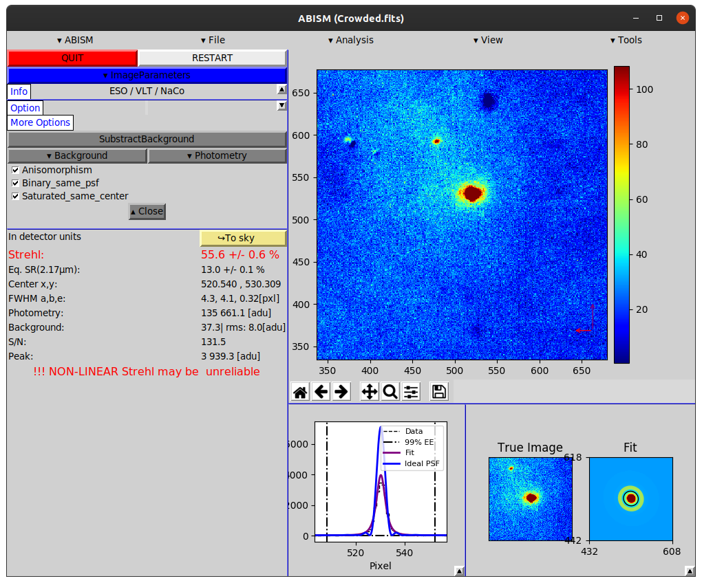

# ABISM : Adaptive Background Interferometric Strehl Meter

__What:__
A graphical user interface (GUI) to measure the strehl ratio.
Meaning the quality (.fits) image from a telescope with adaptive optics.

__Who:__
For observer astronomers using adaptive optics

__How:__

On the following image, we have a Strehl ratio 50% which is excellent.
Notice the warning that we are reaching the non-linearity detector limit.
We did not take time to measure the error of the measure if non linear, it is very detector dependant.

License: Do whatever you want with the code, code whatever you do with your thoughts !
Julien Girard, Martin Tourneboeuf.
