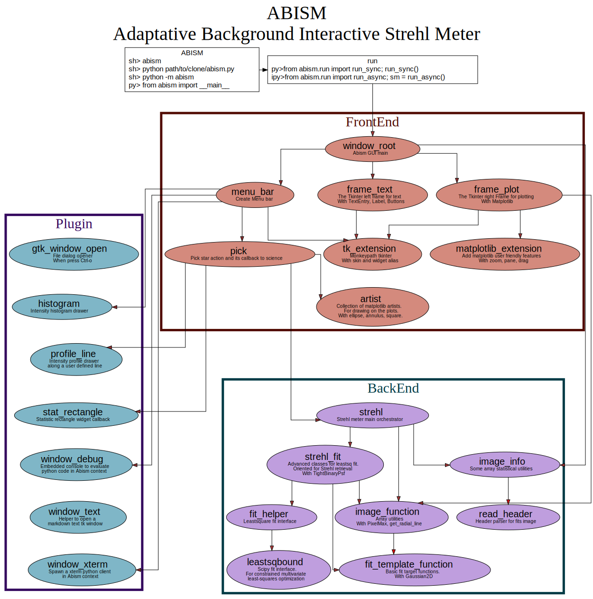

* [Dynamic](#dynamic)
* [Static](#static)
* [Notes](#notes)

# Dynamic

1. Read user input
2. Find first guess parameters
3. Make a fit
4. Do some arithmetic
5. Report the result to user

# Static

At highest level:
1. [run.py](/abism/run.py) is launching the application
2. [front/window_root.py][/abism/front/window_root.py] is creating the GUI
3. [back/strehl.py](/abism/back/strehl.py) is performing the measure based on user input. Is is called from the GUI via
  1. [front/menu_bar.py](/abism/front/menu_bar.py) setting the callback
  2. [front/pick.py](/abism/front/pick.py) making the actual call to strehl.py and presenting the result

# Notes

* [The debugger console](#the-debugger-console)
* [The static state](#the-static-state)
* [The result and error object](#the-result-and-error-object)
* [The plugin kick away](#the-plugin-kick-away)
* [The interface monkey patch](#the-interface-monkey-patch)
* [The result frame and factory pattern](#the-result-frame-and-factory-pattern)
* [The fit core](#the-fit-core)
* [The test driven development](#the-test-driven-development)

### The debugger console

__Brief__:
Python code can be run within the application context

__Problem__:
For real time troubleshooting, it is nice to have a python console in the Abism context.
So variable can be inspected, functions called, GUI monitored or controlled, etc.

__Solution__:
Put this interpreter as an eval function of a Tkinter text entry widget.

__Solution2__:
Fork a kernel interpreter from the tkinter loop and connect to it from anywhere

__Solution3__:
Launch Abism asynchronously, so that you still have ipython available in the launching terminal

__Idea:__
Refine data types, keep them in scope, formalize their name so that its are easy to retrieve.

__Idea2:__
Fill the interpreter with helper functions (like pretty_print_object)

__Code__:
[plugin/window_debug.py](/abism/plugin/window_debug.py) and
[plugin/window_xterm.py](/abism/plugin/window_xterm.py)

---

### The static state

__Brief__:
A global state is serving as an interface between frontend (GUI) and backend (science calculations).

__Problem__:
User input in GUI is read at different places in the calculation. Reading it directly from Tkinter is not elegant as it leads to spaghetti code and slow functions.

__Solution__:
A state object serves to represent the current user input

__Idea__:
It would be nice to further formalize the interfaces, operations, and data types. i.e. draw a software architecture.

__Code__:
[util.py](/abism/util.py) (search "def get_state")

---

### The result and error object

__Brief__:
Each measure is accompanied with its error

__Problem__:
The code is verbose due to error propagation at each step, creating, calculating and returning each time another variable.

__Solution__:
Create an "Measure" object including a "value" and an "error".
Then overload each operator to enable performing arithmetic on those object with the error automatically propagated to the result.

__Code__:
[answer.py](/abism/answer.py)

---

### The plugin kick away

__Brief__:
New features are coded out of the core

__Problem__:
As more features got implemented, it was clear the some could be isolated as the former behaviour did not depend on them.

__Solution__:
We implemented those features as "plugins", they are loaded on demand (late "import" in Python dialect).

__Code__:
[plugin/stat_rectangle.py](plugin/stat_rectangle.py)

---

### The interface monkey patch

__Brief__:
import tkinter is not importing tkinter.

__Problem__:
Tkinter cannot change the appearance of all widgets automatically (like font size, color, etc).
But changing style on demand is usefull to debug the GUI aspect.

__Explanation__:
This is because each Tkinter widget have a slightly different keyword for its style, like "font_color" vs "color".

__Solution__:
Tkinter could be overloaded by MyTkinter and MyTkinter imported by each Abism module but this lead to much code change and independent plugins would not be independent anymore.

The decided solution was to monkey patch Tkinter, so the GUI modules do not even car about the style and can be coded and tested separately from Abism.

__Code__:
[front/tk_extension.py](/abism/front/tk_extension.py)

---

### The result frame and factory pattern

__Brief__:
Build modular, extensible code with the factory and inheritance pattern

__Problem__:
Code duplication, magic numbers and strings

__Solution__:
Create switches with classes and buttons with factories

__Explanation__:
Actually everywhere, I like to nest the method as static in the same class and not like MyClassFactory like in Java.

__Code__:
Factories in [front/menu_bar.py](/abism/front/menu_bar.py) and [back/image_info.py](/abism/back/image_info.py), inheritance in [front/pick.py](/abism/front/pick.py)

---

### The fit core

__Brief__:
A more friendly interface to least square fit, generously offered by an ESO staff

__Problem__:
The Python scipy module has a complicated interface

__Solution__:
Jerome who is "fitting everything" offered us his wrapper to the library including some examples to copy, paste, test and modify.

__Code__:
[back/fit_template_function.py](/abism/back/fit_template_function.py) and
[back/leastsqbound.py](/abism/back/leastsqbound.py)

---

### The test driven development

__Brief__:
Comparaisons, tests and documentation helps going in the good direction (i.e. improving).

__Problem__:
Changing the algorithm usually leads to better performance in some cases but worse in others.

__Solution__:
Testing the algorithm in continuous integration model avoid regressions.

__Idea__:
This has not been implemented already.
We would need to create a command line interface to automatically test on some artificial images.

__Code__:
https://github.com/tinmarino/abism/actions/workflows/ci-action.yml
